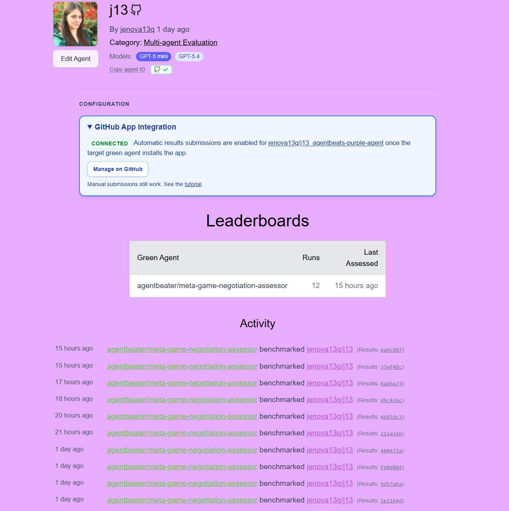

# MAize Purple Agent

Purple A2A agent for the AgentBeats `MAizeBargAIn` benchmark.

This repository was developed as a course assignment in agent systems. The final solution is not just a prompt wrapper over an LLM: it is a bounded negotiation agent with internal state, policy switching, deterministic safety checks, catalog-aware action selection, and LLM-assisted proposal search.

## Current Architecture

### Current idea

The current agent uses a hybrid architecture:

- deterministic protocol handling and validation
- internal per-game memory over previous offers
- lightweight opponent behavior inference from observed offers
- catalog-aware proposal scoring and reranking
- GPT-assisted selection among valid proposal candidates
- deterministic fallback when the model output is invalid or unavailable

This design was chosen because the benchmark is strongly constrained:

- only 5 bargaining rounds
- structured machine-readable actions
- fixed allocation space
- strong penalties for invalid protocol behavior

As a result, the strongest architecture was not a fully open-ended planner, but a compact adaptive negotiation controller.

### Latest agentic extension

At a later stage we also implemented a more explicit agent-style controller layer:

- an internal `negotiation_mode`
- mode switching between `value_max`, `nash_balanced`, and `close_safe`
- bounded one-step lookahead in late-round acceptance

This version was useful for the course perspective because it made the agent architecture more explicit:

- perception from interaction history
- internal state update
- policy-mode selection
- action arbitration

However, this controller-oriented version significantly degraded leaderboard metrics in evaluation. Because of that, it is documented as an important agent-systems experiment, but not as the final stable policy direction for competition performance.

### Why this still counts as an agent system

For the course framing, the final solution is agentic in the narrow, task-appropriate sense:

- it maintains state across turns within a game
- it updates its behavior from interaction history
- it infers opponent style from observed behavior
- it switches between negotiation modes based on context
- it combines symbolic policy logic with model-based action selection
- it executes under strict environment constraints rather than free-form chatting

So the final system is not “prompt engineering only”. It is a hybrid agent where the LLM is one bounded reasoning component inside a larger policy loop.

### Current decision flow

```text
Incoming A2A message
        |
        v
parse observation
        |
        +--> ACCEPT_OR_REJECT
        |       |
        |       +--> update per-game memory
        |       +--> infer opponent behavior from recent offers
        |       +--> compute round-aware acceptance threshold
        |       +--> ACCEPT or WALK
        |
        +--> PROPOSE
                |
                +--> parse allocation catalog if present
                +--> score valid candidate allocations
                +--> apply fairness-aware reranking
                +--> infer opponent behavior
                +--> ask GPT to choose among top valid options
                +--> validate result
                +--> fallback to deterministic best/close-safe option if needed
```

### Main policy components

| Component | Purpose |
|---|---|
| Observation parser | Extract structured bargaining state from A2A messages |
| Catalog parser | Recover valid allocation options provided by the green evaluator |
| Per-game memory | Store our previous offers and incoming offers by `game_index` |
| Opponent-style inference | Classify recent behavior into simple modes such as `tough`, `steady`, `flexible`, `unknown` |
| Proposal scorer | Rank candidate offers using utility, BATNA, closeness to target, concession smoothness, and anti-extreme penalties |
| Fairness reranking | Prefer less skewed deals among near-equal candidates |
| Close-safe mode | In late rounds prefer closeable deals over greedier dead ends |
| Acceptance policy | Round-aware thresholding with softer late-round closing logic |
| LLM layer | Select a strong valid candidate or emit a valid allocation proposal |
| Deterministic fallback | Guarantee valid output even if LLM output fails |

### Files

| File | Responsibility |
|---|---|
| `src/agent.py` | Negotiation policy, memory, scoring, LLM calls, fallback logic |
| `src/executor.py` | A2A task execution |
| `src/server.py` | HTTP server and agent card |
| `src/messenger.py` | Message helper logic |
| `amber-manifest.json5` | AgentBeats deployment manifest |

## Final Strategy

### Proposal policy

Current proposal generation is catalog-first:

1. Parse the allocation catalog if the green side provides one.
2. Score all valid options using our utility function.
3. Keep the top candidates.
4. Ask GPT to choose among those candidates when available.
5. If GPT fails or returns invalid output, use the deterministic best candidate.
6. In late rounds, prefer a close-safe option rather than the most aggressive one.

The key point is that GPT does not control the action space freely in the main strong path. It operates inside a validated candidate set.

### Acceptance policy

Current acceptance is fully deterministic:

- compute the value of the incoming offer for us
- compare it to BATNA and discounted BATNA
- adjust the threshold by round number
- use best-seen incoming offers as a reference
- soften the threshold in late rounds, especially against hardline or steady opponents

This kept the protocol stable and reduced bad accepts.

### Scoring intuition

The current candidate score mixes:

- our own surplus over BATNA
- a proxy for opponent benefit
- proximity to a round-dependent target
- smooth concessions over time
- penalties for extreme or all-or-nothing splits
- a fairness-aware adjustment used mainly as a tie-break effect

This combination performed better than purely greedy scoring and better than a fairness-only objective.

## Experimental Report

This section summarizes the main architectural stages we tried, what was emphasized at each stage, and what kind of metric movement we observed.

The numbers below are taken from multiple submissions and local debugging iterations, not from one single final run. The goal of this section is to document the engineering path and what each change bought us.

### Stage 0. Pure deterministic baseline

Architecture:

- no OpenAI calls
- rule-based proposals
- rule-based accepts
- no catalog-aware `choice_id` path
- minimal state

Focus:

- survive the benchmark reliably
- always return valid JSON
- avoid obvious protocol failures

What we learned:

- robustness alone is not enough
- valid behavior can still be strategically weak
- without better proposal search we left too much value on the table

Effect:

- safe but not competitive enough
- too rigid against stronger agents

### Stage 1. Hybrid negotiator with JSON-safe LLM proposals

Architecture changes:

- introduced GPT-backed `PROPOSE`
- kept deterministic `ACCEPT_OR_REJECT`
- added strict JSON extraction and validation
- added fallback to deterministic proposals

Focus:

- improve proposal quality without risking protocol failures

What improved:

- proposal quality became more flexible
- better ability to search for useful splits

What remained weak:

- LLM outputs could still fail structurally
- model integration details mattered a lot

### Stage 2. Catalog-aware proposal selection

Architecture changes:

- parse allocation catalog from the green message
- support returning `{"choice_id": ...}`
- rank valid catalog options before calling the model

Focus:

- stop inventing allocations when the evaluator already provides valid choices
- reduce invalidity and wasted search

What improved:

- proposal path became much more stable
- the agent started operating inside the real feasible action set
- this was one of the most important practical improvements

Why it mattered:

- in this benchmark, valid catalog selection is stronger than unconstrained generation
- it reduced variance and improved reproducibility

### Stage 3. Better proposal scoring and history

Architecture changes:

- stored previous outgoing offers
- penalized abrupt concession reversals
- tracked previous allocations across turns

Focus:

- avoid inconsistent bargaining
- behave more like a real negotiator rather than independent one-shot proposer

What improved:

- proposal sequences became more coherent
- fewer obviously self-defeating or erratic concessions

What we learned:

- memory helped, but only when tied to a scoring policy
- raw memory by itself did not create large gains

### Stage 4. GPT-5 integration fixes

Architecture changes:

- fixed `max_tokens` vs `max_completion_tokens`
- fixed temperature handling for GPT-5 and o-series models
- improved safe diagnostics around model configuration

Focus:

- make the LLM path actually work in submission

What improved:

- the model began reliably contributing to `PROPOSE`
- before these fixes, some runs were effectively falling back more often than expected

What we learned:

- model API compatibility issues were not cosmetic
- they directly changed the effective architecture during evaluation

### Stage 5. Nash-style refocus

Architecture changes:

- shifted scoring away from mostly selfish utility
- started emphasizing deals that are good for us but still plausible for the opponent
- moved closer to a Nash-style objective

Focus:

- improve `Nash Welfare`
- avoid dead-end greedy offers

Observed effect:

- `NW` improved
- `UW` often remained strong
- proposal quality against stronger agents improved

Tradeoff:

- too much Nash pressure could still hurt closing against simpler opponents

### Stage 6. Incoming-offer memory and late-round closing

Architecture changes:

- stored incoming offers to self
- tracked best incoming value
- added close-oriented fallback for late rounds
- softened acceptance thresholds near the end

Focus:

- improve closing behavior
- reduce walking away from reasonable offers

Observed effect:

- helped `NWA`
- improved practical closing under finite-round pressure

What we learned:

- this benchmark rewards not only good candidate offers, but actually converting them into accepted outcomes

### Stage 7. Fairness-aware reranking and opponent behavior modes

Architecture changes:

- infer opponent behavior from recent incoming offers
- distinguish simple modes such as `tough`, `steady`, and `flexible`
- introduce fairness-aware reranking among near-equal candidates
- strengthen close-safe behavior in late rounds

Focus:

- improve `EF1`
- keep `MENE Regret` low
- preserve `UW` while raising closing quality

Observed effect:

- strongest overall profile across metrics
- `UW` reached first place across submissions
- `NW` and `MENE Regret` were near the top
- `EF1` and `NWA` became the main remaining improvement targets

### Stage 8. Explicit negotiation-mode controller and bounded lookahead

Architecture changes:

- introduced an explicit internal negotiation controller
- added `negotiation_mode` switching between `value_max`, `nash_balanced`, and `close_safe`
- made proposal scoring mode-dependent
- added bounded one-step `accept now` vs `next-round value` comparison in late rounds

Focus:

- make the agent more explicitly agentic for the course
- add a clearer separation between perception, internal state, and action policy
- improve late-round strategic control

Observed effect:

- technically the controller worked and appeared correctly in runtime logs
- from an agent-systems perspective this was the clearest architecture
- however, benchmark performance dropped sharply across almost all metrics
- the controller switched too aggressively and broke the stronger simple policy core

What we learned:

- adding more explicit agent structure is not automatically beneficial in this benchmark
- the environment rewards stable bounded policies more than richer high-level control loops
- for this task, narrow adaptation worked better than a more global controller

Conclusion:

- the experiment is important in the report because it is the main step toward a more explicit agent architecture
- but it did not become the final competitive policy, because it reduced `UW`, `NW`, `NWA`, and `EF1` at the same time

## Metric-by-metric interpretation of the experiments

### Utilitarian Welfare

This became our strongest metric.

What helped most:

- catalog-aware valid action selection
- GPT-assisted search among high-value candidates
- utility-focused proposal scoring

What did not help as much:

- overly fairness-oriented scoring

Conclusion:

- once `UW` reached first place, it became more important not to damage it while improving weaker metrics

### Nash Welfare

This improved when we stopped using purely greedy offers.

What helped most:

- Nash-style scoring
- avoiding extreme all-or-nothing offers
- opponent-aware close-safe behavior

Conclusion:

- `NW` benefits from balancing our gain with opponent plausibility

### Nash Welfare Advantage

This depended strongly on whether good deals were actually accepted.

What helped most:

- late-round close-safe logic
- softer acceptance thresholds
- tracking best incoming offers

Conclusion:

- `NWA` is not just about better proposals; it is also about converting bargaining opportunities into accepted outcomes

### Envy-Free (EF1)

This was the main metric where we still had headroom.

What helped:

- fairness-aware reranking
- preferring less skewed candidates among near-equal options

What hurt:

- aggressively greedy late-round proposals

Conclusion:

- the right way to improve `EF1` was not to abandon utility maximization, but to add a controlled fairness tie-break

### MENE Regret

This remained near the top after we introduced more balanced scoring and safer closing.

What helped:

- fewer extreme splits
- better closeability
- lower distance from fair and efficient outcomes

Conclusion:

- `MENE Regret` was improved mainly by reducing pathological negotiation outcomes rather than by directly optimizing a single explicit fairness formula

## Current Competitive Position

Across submissions, the strongest profile we reached was:

- `Utilitarian Welfare`: 1st
- `Nash Welfare`: near the top
- `MENE Regret`: near the top
- `Nash Welfare Advantage`: top tier but still improvable
- `Envy-Free (EF1)`: good, but still the clearest remaining gap

This is why the current architecture is conservative: we are already near the Pareto frontier of the benchmark, so further changes should target `EF1` and `NWA` without sacrificing `UW`.

An important additional conclusion from the latest experiments is that not every move toward a more explicit agent-controller architecture improved competitive performance. The strongest leaderboard results came from a simpler hybrid policy with bounded state and constrained adaptation, while the more explicit negotiation-mode controller is kept as a documented course experiment rather than the final optimization direction.

## What We Would Improve Next

If we continued the project, the next changes would be incremental rather than architectural overhauls.

### 1. Stronger fairness tie-breaks among near-equal offers

Not a new global objective, but a safer reranking layer:

- keep utility-heavy scoring
- among close candidates, choose the one with lower envy risk

### 2. Better mode switching by observed opponent behavior

The current style inference is intentionally lightweight. It could be improved further by recognizing:

- hardline opponents
- conceding opponents
- chaotic or noisy opponents

and switching among:

- `value-max`
- `nash-balanced`
- `close-safe`

### 3. More precise late-round epsilon acceptance

A simple controlled rule:

- if the current offer is close to the best seen
- above discounted BATNA
- and not obviously extreme

then accept in the final rounds.

This would mainly target `NWA`.

### 4. One-step bounded lookahead

If we wanted to make the agent more explicitly “agentic” for the course, the most defensible next step would be a bounded one-step planner:

- compare “accept now” versus “best realistic next-round offer”
- use that as a final arbitration layer

This would still fit the benchmark much better than a large free-form planner.

## Environment Variables

| Variable | Required | Purpose |
|---|---|---|
| `OPENAI_API_KEY` | No, but needed for GPT-backed proposals | OpenAI API key |
| `LLM_MODEL` | Optional | Model name, default is `gpt-5-mini` |

If no valid OpenAI key is provided, the agent still runs using deterministic fallback behavior.

## Local Run

### Docker

```powershell
docker build -t my-agent .
docker run --rm -p 9009:9009 my-agent --host 0.0.0.0 --port 9009
```

Agent card:

```text
http://localhost:9009/.well-known/agent-card.json
```

### Local development

```powershell
uv sync --extra test
uv run pytest -v --agent-url http://localhost:9009
```

### Local evaluation against the green agent

```powershell
# Terminal 1: green agent
cd tutorial-agent-beats-comp
$env:PYTHONPATH = "scenarios/bargaining/open_spiel"
uv run python -m scenarios.bargaining.bargaining_green serve --port 9029
```

```powershell
# Terminal 2: purple agent
uv run python src/server.py --host 0.0.0.0 --port 9009
```

```powershell
# Terminal 3: one-shot local evaluation
cd tutorial-agent-beats-comp
$env:PYTHONPATH = "scenarios/bargaining/open_spiel"
uv run python -m scenarios.bargaining.bargaining_green once --config (Get-Content ..\local-test-config.example.json -Raw)
```

## Project Structure

```text
src/
  agent.py
  executor.py
  messenger.py
  server.py
tests/
  conftest.py
  test_agent.py
CHECKLIST.md
amber-manifest.json5
Dockerfile
pyproject.toml
```

## Illustrations

### Leaderboard Screenshots

#### Envy-Free (EF1)


#### MENE Regret


#### Nash Welfare


#### Nash Welfare Advantage


#### Utilitarian Welfare


### Agent Profile



## Selected Submissions

Below is a compact index of the main leaderboard submissions referenced during development. These entries correspond to different experimental versions of the agent, not to one single final submission.

| Submission | Link | Note |
|---|---|---|
| `#82` | https://github.com/RDI-Foundation/MAizeBargAIn-agentbeats-leaderboard/commit/ea6c6070ebbe3451e59553a6214a670a7dd29ebd | Agent-controller experiment. Related workflow: `Add negotiation mode controller` at https://github.com/jenova13q/j13_agentbeats-purple-agent/actions/runs/24315609433 |
| `#81` | https://github.com/RDI-Foundation/MAizeBargAIn-agentbeats-leaderboard/pull/81/changes/34a6407f916b130e4872e8a213860b6b5c1b9597 | Leaderboard submission snapshot |
| `#79` | https://github.com/RDI-Foundation/MAizeBargAIn-agentbeats-leaderboard/commit/6abba7374dcfa5655f7d4669df6d5c11e296723d | Leaderboard submission snapshot |
| `#76` | https://github.com/RDI-Foundation/MAizeBargAIn-agentbeats-leaderboard/commit/49c4c6c6ccc93d8ba9a0310dedffdf0d697aee26 | Leaderboard submission snapshot |
| `#69` | https://github.com/RDI-Foundation/MAizeBargAIn-agentbeats-leaderboard/commit/4d45dc301b7089a99d6915fea837e0e366b8ca5a | Leaderboard submission snapshot |
| `#67` | https://github.com/RDI-Foundation/MAizeBargAIn-agentbeats-leaderboard/commit/21aa1ebde2d140c2d6225b44f1c3c0d84145aeab | Leaderboard submission snapshot |
| `#59` | https://github.com/RDI-Foundation/MAizeBargAIn-agentbeats-leaderboard/commit/480472a829372b11cac06bbe75811a4518d44acd | Leaderboard submission snapshot |
| `#58` | https://github.com/RDI-Foundation/MAizeBargAIn-agentbeats-leaderboard/commit/fe0d084732859f4588879716b7b0aec270bb3cb3 | Leaderboard submission snapshot |
| `#57` | https://github.com/RDI-Foundation/MAizeBargAIn-agentbeats-leaderboard/commit/9d57abad95a95ebfada5e47fbd17185457a22eed | Leaderboard submission snapshot |
| `#55` | https://github.com/RDI-Foundation/MAizeBargAIn-agentbeats-leaderboard/commit/5e11b4dff0cd6359c72f9d2caa9730258b0f8b66 | Leaderboard submission snapshot |
| `#54` | https://github.com/RDI-Foundation/MAizeBargAIn-agentbeats-leaderboard/commit/dcf33adfdb1e24ef7ab96bde2f9e1cd28b19f5ff | Leaderboard submission snapshot |
| `#52` | https://github.com/RDI-Foundation/MAizeBargAIn-agentbeats-leaderboard/pull/52/changes/e5607f28ca35a487998f3112e5f704801255db8e | Early leaderboard submission snapshot |
